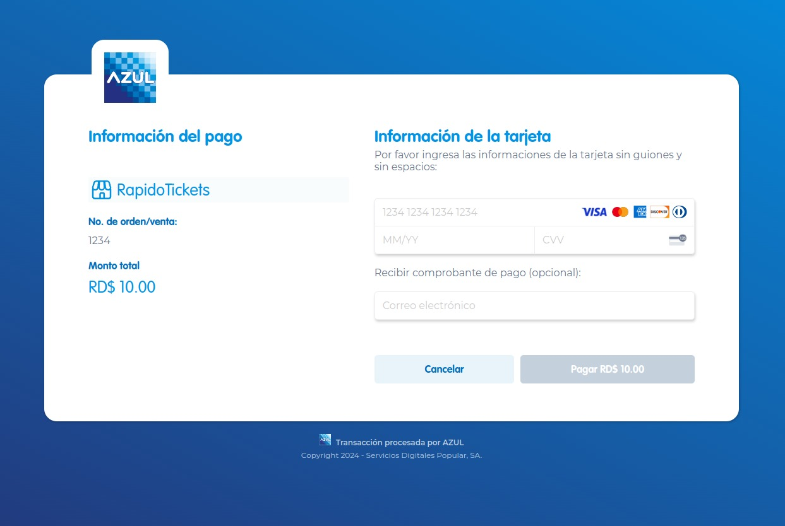

<div align="center">
    <h1>azul-ts</h1>
    <big>Typescript library to seamlessly integrate with Azul payment gateway</big>
    <div>
    <br/>
        <a href="https://github.com/lucrise-llc/azul-ts/pulse"></a>
        <a href="https://github.com/lucrise-llc/azul-ts/pulls"></a>
        <a href="https://github.com/lucrise-llc/azul-ts/issues"></a>
    </div>
</div>
<br/>
</div>

## Introduction

This library is a Typescript wrapper for the Azul payment gateway API.

It provides a simple and intuitive interface for interacting with the Azul API, allowing you to easily integrate Azul payment gateway into your application.

## Features

- Support for both Azul Payment Page and API (WebService)
- Type-safe request and response handling.
- Throughly tested and documented.

## Installation

```bash
$ npm install @lucrise/azul-ts
```

## Usage

### Payment Page

To use the Azul Payment page, you need to initialize the `AzulPage` class with your merchant ID, auth key, merchant name, merchant type, and environment.

```typescript
import AzulPage from '../azul-page';

const azul = new AzulPage({
  merchantId: process.env.MERCHANT_ID!,
  authKey: process.env.AUTH_KEY!,
  merchantName: 'RapidoTickets',
  merchantType: 'Ecommerce',
  environment: 'dev'
});
```

The `merchantId` is the merchant ID provided by Azul.<br/>
The `authKey` is the authentication key provided by Azul.<br/>
The `merchantName` is the name of the merchant.<br/>
The `merchantType` is the type of merchant (e.g. Ecommerce, Retail, etc.).<br/>
The `environment` is the environment in which the merchant is operating (e.g. dev, prod, etc.).<br/>

Then, you can create a form that will redirect the user to the Azul Payment Page.

For example, let's assume you are calling the `createForm` from the frontend after clicking the "Pay now" button.

You'd need to pass the following parameters to the `createForm` function:

```typescript
import express from 'express';

const app = express();

app.get('/pay-now', async (req, res) => {
  res.send(
    azul.createForm({
      orderNumber: req.query.orderNumber,
      amount: req.query.amount,
      ITBIS: req.query.ITBIS,
      approvedUrl: 'https://rapidotickets.com/approved',
      declinedUrl: 'https://rapidotickets.com/declined',
      cancelUrl: 'https://rapidotickets.com/canceled'
    })
  );
});

app.listen(3000);
```

Upon submitting the form, the user will be redirected to the Azul Payment Page, where they can enter their payment information and complete the transaction.

This form is invisible to the user, it only serves as a way to redirect them to the Azul Payment Page.



Depending whether the transaction was successful or not, you'll need to redirect the user to the appropriate route.

The `approvedUrl`, `declinedUrl`, and `cancelUrl` parameters are used to specify the URLs that the user will be redirected to after a successful or unsuccessful transaction. You'll need to handle these escenarios accordingly.

Let's assume the user successfully completes the transaction. The user will be redirected to the `approvedUrl` route with the following query parameters:

```
https://rapidotickets.com/?OrderNumber=1234&Amount=1000&Itbis=100&AuthorizationCode=OK7433&DateTime=20240502233454&ResponseCode=ISO8583&IsoCode=00&ResponseMessage=APROBADA&ErrorDescription=&RRN=2024050223345744343807&AuthHash=ead90f9eecf951f612a11bb6f722786ea2c68b78a147f40a13a7ec4be9ee0bd315eee55a5a96169e61516155e4b66c39ad764338de87c24b7ac88bf819965596&CustomOrderId=&CardNumber=54241802****1732&DataVaultToken=&DataVaultExpiration=&DataVaultBrand=&AzulOrderId=44343807&DCCOffered=1&DCCApplied=0&DCCCurrency=840&DCCCurrencyAlpha=USD&DCCExchangeRate=00185&DCCMarkup=500&DCCAmount=019&Discounted=0
```

## API (WebService)

To use the Azul API, you need to initialize the `AzulAPI` class with your merchant ID, auth keys, and certificates.

```typescript
import AzulAPI from '@lucrise/azul-ts';

const azul = new AzulAPI({
  auth1: 'your-auth1',
  auth2: 'your-auth2',
  merchantId: 'your-merchant-id',
  certificate: 'path/to/certificate.crt',
  key: 'path/to/private.key',
  environment: 'dev',
  channel: 'EC'
});
```

The `auth1` and `auth2` are the authentication credentials provided by Azul.<br/>
The `merchantId` is the merchant ID provided by Azul.<br/>
The `certificate` is the certificate sent to you by Azul. Can be provided as a file path or PEM content directly.<br/>
The `key` is the private key that generated the CSR file. Can be provided as a file path or PEM content directly.<br/>
The `environment` determines which Azul endpoint to use ('dev' or 'prod'). Defaults to 'dev'.<br/>
The `channel` is the payment channel code provided by Azul. Defaults to 'EC'.<br/>

Then, you can use the `AzulAPI` class to make requests to the Azul API.

For example, let's assume you want to make a Sale transaction from your web application to a server running the Azul API.

```typescript
import express from 'express';

const app = express();

app.get('/pay-now', async (req, res) => {
  const result = await azul.payments.sale({
    cardNumber: req.query.cardNumber, // Card number without spaces or special chars
    expiration: req.query.expiration, // Format: YYYYMM (e.g., 202412)
    CVC: req.query.CVC, // 3 or 4 digits
    amount: req.query.amount, // Integer. Last 2 digits are decimals (e.g., 1000 = $10.00)
    ITBIS: req.query.ITBIS, // Integer. Last 2 digits are decimals (e.g., 100 = $1.00)
    customOrderId: req.query.customOrderId, // Optional. Max 75 chars. Used for payment verification
    orderNumber: req.query.orderNumber, // Optional. Max 15 chars
    channel: 'EC', // Optional. Defaults to 'EC'
    posInputMode: 'E-Commerce', // Optional. Defaults to 'E-Commerce'
    saveToDataVault: '2', // Optional. '1' to save card, '2' to not save
    altMerchantName: 'My Store' // Optional. Max 25 chars. Shown in card statement
  });

  res.send(result);
});

app.listen(3000);
```

Unlike the Payment Page, the API does not require a redirection or any sort of form. It straights send your transaction data to the Azul WebService and result is returned in the response.

**NOTE: It is heavily recomended to set the `timeout` for this request to at least 120 seconds.**

For more examples, please take a look at our [tests](./tests) and [examples](./examples).
